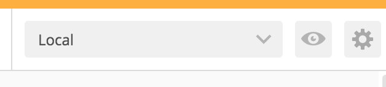
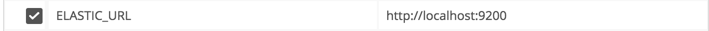

# Postman Elastic Search Collection

This collections work with elastic search version 2.4

To Setup your Local Environment For ELASTIC_URL

Open Postman

Click to 

Add to 

Download the [Elastic-Search.postman_collection](https://github.com/mrpehlivan/PlayWithElasticSearch/blob/master/postman/Elastic-Search.postman_collection) file and you can work.
